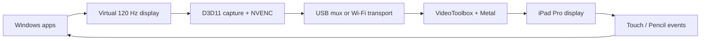

# Architecture

The target is a real Windows extended monitor, not desktop mirroring. A signed
virtual-display driver exposes a 2420 x 1668, 120 Hz monitor to Windows. The
custom host captures that monitor, encodes through NVIDIA NVENC, and sends only
the newest frame. The iPad app decodes in VideoToolbox and presents through
Metal at 120 Hz.

## Latency policy

- Capture, encode, transport, decode, and render queues each hold at most one
  replaceable frame.
- H.264 uses no B-frames, a short GOP, repeated SPS/PPS at IDR frames, and
  NVENC's ultra-low-latency tuning.
- The renderer is clocked at 120 Hz and consumes the latest decoded pixel
  buffer; an old frame is dropped rather than displayed late.
- USB uses reliable TCP over usbmux because packet loss is effectively absent.
  Wi-Fi will use a datagram media channel with a reliable control channel.

## Checkpoints

1. **Included now:** native iPad listener, H.264 hardware decode, 120 Hz Metal
   renderer, touch/Pencil return packets, Windows protocol implementation, and
   a Windows NVENC test-pattern source.
2. Add signed virtual-display-driver orchestration and D3D11 desktop capture.
3. Add Wi-Fi discovery, low-latency datagrams, congestion control, and seamless
   USB/Wi-Fi handoff.
4. Add Windows pointer/pen injection, audio capture/playback, installer,
   background service, and connection-state recovery.

