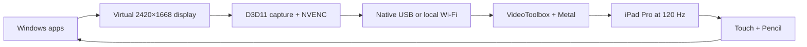
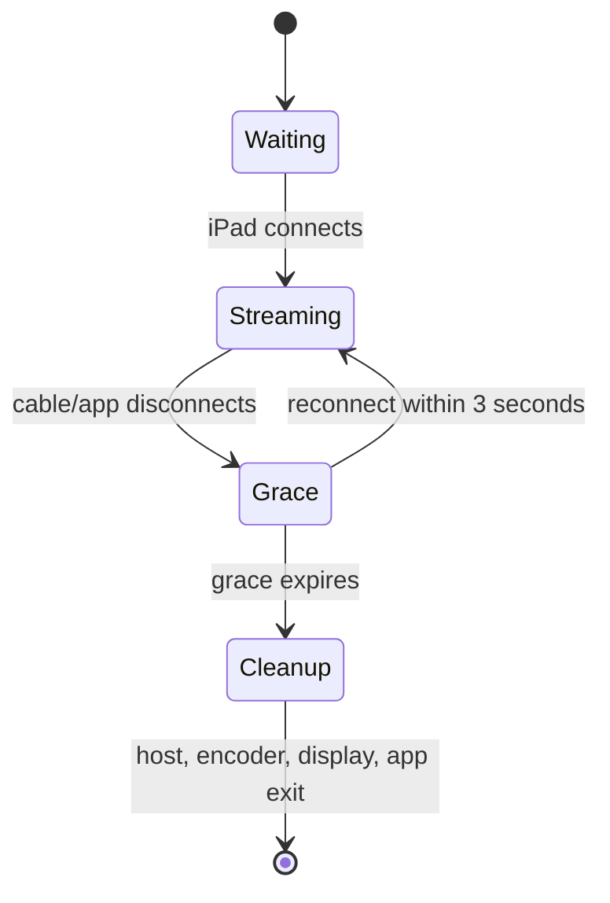

# Architecture

PadBridge exposes a real Windows monitor, captures only that monitor, sends a
low-latency hardware-encoded stream, and returns normalized touch/Pencil input.

## Windows controller

`PadBridge.exe` owns the complete session:

1. Enables extended-display mode.
2. Restores the virtual monitor to 2420 × 1668 at 120 Hz.
3. Enumerates the target monitor in the same order used by input injection.
4. Chooses trusted USB or discovers `_padbridge._tcp.local` over Bonjour.
5. Starts `padbridge_host.exe` and the bundled `ffmpeg.exe` without a console.
6. Optionally routes newly shown top-level windows to the display under the cursor.
7. Kills the full process tree and collapses the virtual display on disconnect.

The USB path implements the plist usbmux protocol directly against Apple Mobile
Device Service at loopback port 27015. A loopback listener forwards host port
52100 to the iPad app, eliminating Python and `iproxy`.

## Latency and frame policy

- `ddagrab` captures D3D11 frames from only the virtual monitor.
- The zero-copy route keeps frames on the RTX GPU through NVENC.
- H.264 uses NVENC `p1`, ultra-low-latency tuning, CBR, no B-frames, and IDR
  frames containing decoder configuration.
- Capture timestamps are limited to 120 unique frame slots while static desktop
  suppression is retained.
- TCP_NODELAY is active on host, controller forwarding, and iPad listener paths.
- VideoToolbox decodes asynchronously; `FrameMailbox` stores one replaceable
  pixel buffer.
- Metal renders the newest decoded frame on VSync with two drawables.
- Sustained activity promotes the iPad to 120 Hz; idle presentation is 1 Hz.

## Disconnect state machine

The iPad cancels networking and decode when backgrounded. iPadOS does not allow
third-party apps to terminate themselves; when left foregrounded without a
connection, PadBridge uses a 1 Hz waiting view and re-enables normal auto-lock.

## Input mapping

The iPad sends normalized coordinates in the aspect-fitted video rectangle.
Windows maps them to physical pixels of the exact virtual-monitor rectangle.
Finger contacts use Windows synthetic touch, and Pencil uses a synthetic pen
device with pressure and X/Y tilt. Pointer lifecycle normalization prevents
late moves, duplicate downs, and stale reconnect events from poisoning the
Windows injection sequence.

## Trust boundary

USB forwarding binds only to `127.0.0.1`. Wi-Fi traffic stays on the local
network. This personal-device release does not expose an internet listener.
